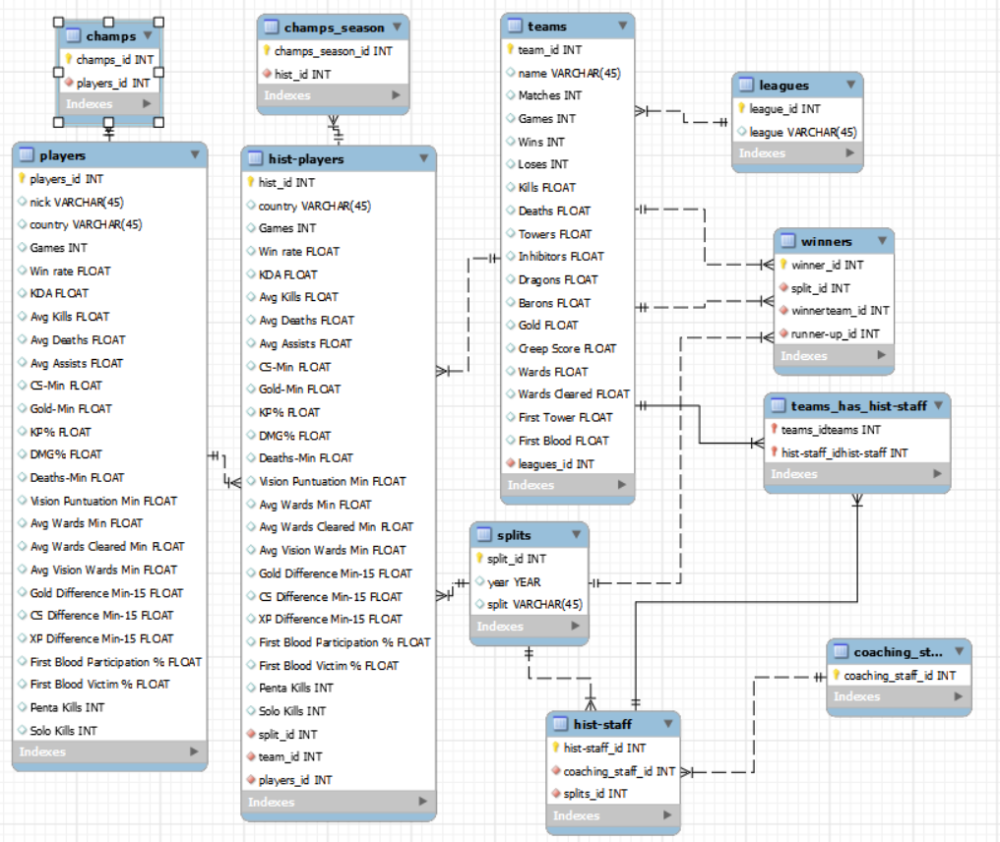

# MrLinx-Data_ETL

# Objetivo principal

En el siguiente proyecto se busca rellenar a través de un proceso de ETL (Extract-Transform-Load) una base de datos creada por nosotros mismos en MySQL. En este caso se rellenará dicha base de datos con datos sobre el League of Legends como esport, con el fin de tener acceso a cierta información de calidad en el futuro a través de querys.

# Proceso del proyecto a nivel general

El proceso se divide en los siguientes pasos:

-Busqueda y extracción de los datos a utilizar desde distintas páginas webs utilizando distintos métodos.
- Creación de dicha estructura en MySQL a través de un modelo entidad relación.
- Análisis exhaustivo en Pandas de los datos y limpieza de los mismos.
- Reestructuración de los datos con Pandas preparándolos para la futura inserción en la base de datos. 
- Inserción de los datos en la base de datos.
- Realización de querys de prueba y de posible interés.

# Explicación del proceso y toma de decisiones

Para empezar en base a la observación de los datos estructuro un modelo entidad relación de la siguiente manera:

**DISCLAIMER** Para este proyecto solo se ha tenido en cuenta en cuanto a ciertos aspectos la Superliga, la liga nacional de lol en España. Es por esto por lo que se dará a entender posteriormente que habrá tablas vacias a pesar de que en un futuro se planea la ampliación de los datos. En un futuro se tiene intención de introducir otras muchas competiciones y otros datos de interés ya contemplados en el modelo y  que serán explicados posteriormente

EXPLICACIÓN DEL MODELO ENTIDAD RELACIÓN

Explicado de izquierda a derecha se entiende que:
    
* Tendremos una tabla players con cada jugador del que tenemos datos y la media de sus datos acumulados a lo largo de su carrera.
* Esta se relaciona con champs, tabla que en un futuro contendrá los datos del desempeño de cada jugador con cada campeón a lo largo de su carrera, aunque por ahora está vacía.
*Players también se relaciona a través de una relación one to many con hist-players, tabla que almacena los datos de todos los jugadores desglosados por temporada. 
* Es por esto que esta a su vez se relaciona con la tabla splits la cual ubica en que temporada se encuentra cada jugador de la tabla hist-players. 
* También se relaciona con champs_season, tabla que en un futuro será rellenada con los daros del desempeño de dichos jugadores con cada campeón en cada temporada (una especie de hist_champs).
* Por último se relaciona con una relación nuevamente one to many con la tabla teams, la cual almacena (por el momento) los equipos de Superliga a los que se ha tenido registro, señalando a que equipo pertenecían dichos jugadores en dicho momento del tiempo.
*Teams por su lado se relaciona con leagues, la cual almacenará por el momento un único dato introducido a mano, el de la Superliga.
* También se relaciona con winners, tabla a la que atribuye dos foreing keys pues en esta se almacena el ganador de cada split (la tabla winners también se relaciona con la tabla splits) y el subcampeón de dichos splits.
*Por último también se contempla añadir el coaching staff en el futuro para lo que se ha dispuesto las tablas hist_staff y staff las cuales se relacionan con teams y con splits (la de hist-staff como ya lo haría hist-players) y con la propia hist-staff (la de staff como se podía suponer).
 

    

EXTRACCIÓN Y LIMPIEZA DE LOS DATOS

  
En cuanto a la extracción de los datos, esta se ha realizado principalmente siguiendo métodos de scraping aunque también se ha utilizado un CSV proveniente de una web del género con los datos de los equipos[^1]. Para el scrapeo se ha programado una función con selenium que de forma automática substraía el nombre de los equipos y los jugadores que los integraban según el split y el año. También se ha utilizado en gran medida la función ".copy_clipboard()" de pandas con la que se han substraído los datos de los jugadores y de los ganadores de las temporadas (cada uno de los cuales venían de webs distintas)[^2][^3]. 
  

En cuanto a la estructuración y limpieza de los datos, primeramente se han concatenado las tablas necesarias de modo que se finalizasen creando las tablas que más adelante se introducirán en SQL. Este proceso no ha sido inmediato al inicio de dicha limpieza pues algunas tablas dependían de cambios previos para realizar dicha creación.
  
Por otro lado se han conservado nulos en gran parte de los valores numéricos pues no se ha encontrado la forma de rellenarlos ni a 0, ya que no representaría un valor real en el dato y alteraría gravemente la percepción de la performance del jugador en particular, ni tampoco con la media,mediana o moda por la misma razón. De este modo se considera que conservar los nulos es lo más acercado a la realidad que es la finalidad de este proyecto queriendo ser lo más fieles a la realidad posibles. Eso no quita que si se hayan rellenado los posibles sacando ciertos datos o rellenando con desconocido la nacionalidad. También se han hecho más legibles múltiples datos (la misma nacionalidad siendo uno de ellos).
  
Por último se han trasladado y traducido allí donde correspondían las columnas que harían de conexión generando una relación dentro de SQL a modo de foreing keys.

[^1]: (https://www.rotowire.com/esports/team-stats-lol.php?league=4213&series=)
[^2]: (https://gol.gg/players/list/season-S13/split-Spring/tournament-ALL/)
[^3]: (https://liquipedia.net/leagueoflegends/Liga_de_Videojuegos_Profesional)

# Conclusiones

El resultado final del proyecto es una base de datos con una estructura adecuada aunque por finalizar donde ya se pueden empezar a vislumbrar características interesantes pudiendo acceder ya a datos de verdadero interés de la Superliga
