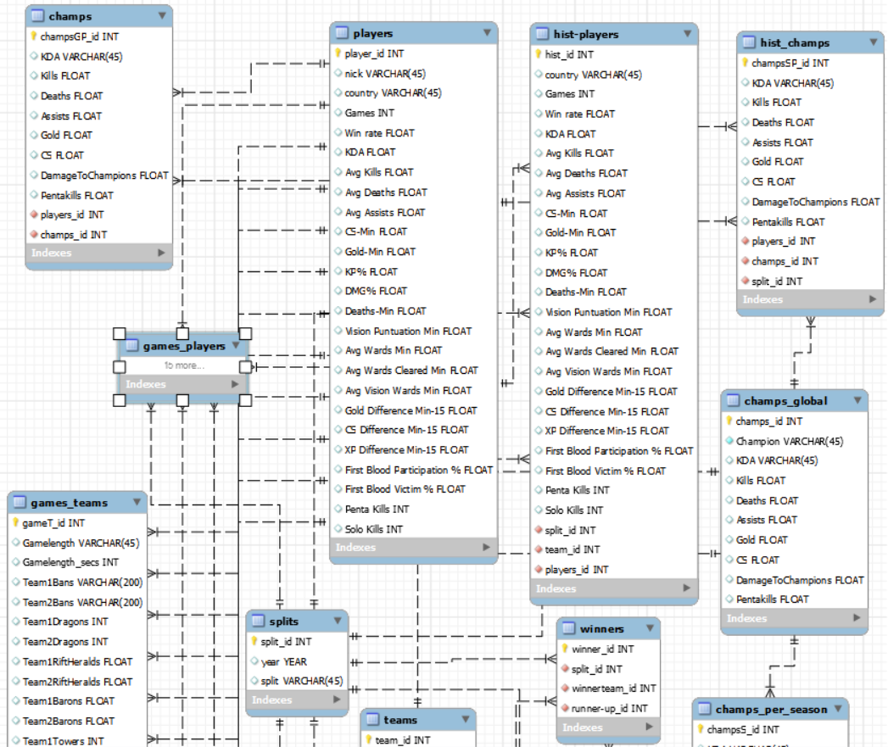
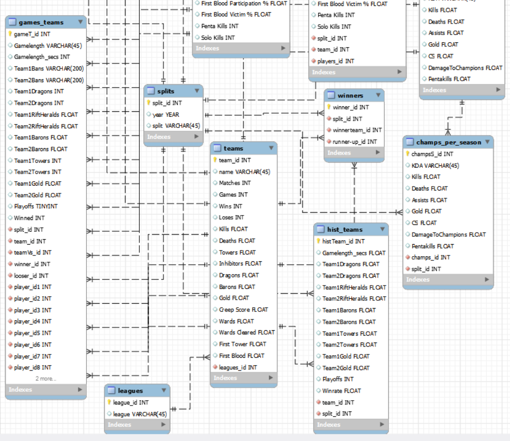

# MrLinx-Data_ETL

# Objetivo principal

En el siguiente proyecto se busca rellenar a través de un proceso de ETL (Extract-Transform-Load) una base de datos creada por nosotros mismos en MySQL. En este caso se rellenará dicha base de datos con datos sobre el League of Legends como esport, más concretamente con datos de la Superliga, con el fin de tener acceso a cierta información de calidad a través de querys.

# Proceso del proyecto a nivel general

El proceso se divide en los siguientes pasos:

- Busqueda y extracción de los datos a utilizar desde distintas páginas webs utilizando distintos métodos.
- Creación de dicha estructura en MySQL a través de un modelo entidad relación.
- Análisis exhaustivo en Pandas de los datos y limpieza de los mismos.
- Reestructuración de los datos con Pandas preparándolos para la futura inserción en la base de datos. 
- Inserción de los datos en la base de datos.
- Realización de querys de prueba y de posible interés.

# Explicación del proceso y toma de decisiones

Para empezar en base a la observación de los datos estructuro un modelo entidad relación de la siguiente manera:

EXPLICACIÓN DEL MODELO ENTIDAD RELACIÓN

Explicando las distintas tablas y sus relaciones:
    
* Para empezar tenemos la tabla players con cada jugador del que tenemos datos y la media de sus datos acumulados a lo largo de su carrera en Superliga.
* Esta se relaciona con champs, tabla que contiene los datos globales en su carrera en Superliga con cada campeón utilizado. Esta también se relaciona con champs_global la cual es el equivalente de players a los campeones, con los datos globales de los campeones en la Superliga.
* Players también se relaciona a través de una relación one to many con hist-players, tabla que almacena los datos de todos los jugadores desglosados por temporada.
* Hist-players se relaciona con hist_champs la cual representa los datos del historico de los jugadores con los campeones usados esa temporada. Esta última también se relaciona con champs_global para sacar el campeón al que se refiere. 
* Ambas se relacionan a su vez con la tabla splits la cual ubica en que temporada se encuentran. 
* Por último se relaciona con una relación nuevamente one to many con la tabla teams, la cual almacena los equipos de Superliga a los que se ha tenido registro, señalando a que equipo pertenecían dichos jugadores en dicho momento del tiempo.
* Lo mismo pasa con la tabla games_players la cual contiene los datos de las estadísticas de cada jugador en cada partido. Esta se relaciona con teams, con split, con players y con champs_global para rellenar los datos.
* Games_teams representa estos mismos partidos pero con los datos de los equipos por partido así como que jugadores participaban en dichos partidos. Tiene las mismas relaciones que la anterior mencionada games_players aunque forma distinta por razones obvias.
* Teams por su lado se relaciona con leagues, la cual almacenará por el momento un único dato introducido a mano, el de la Superliga.
* También se relaciona con winners, tabla a la que atribuye dos foreing keys pues en esta se almacena el ganador de cada split (la tabla winners también se relaciona con la tabla splits) y el subcampeón de dichos splits.
* Por último existe también un hist_teams con el histórico de los equipos por temporada el cual se relaciona con teams y split. 
 

    

EXTRACCIÓN Y LIMPIEZA DE LOS DATOS

  
En cuanto a la extracción de los datos, inicialmente hemos estado usando métodos de scraping además de usar también un CSV proveniente de una web del género con los datos de los equipos[^1]. Para el scrapeo se ha programado una función con selenium que de forma automática substraía el nombre de los equipos y los jugadores que los integraban según el split y el año. También se ha utilizado en gran medida la función ".copy_clipboard()" de pandas con la que se han substraído los datos de los jugadores y de los ganadores de las temporadas (cada uno de los cuales venían de webs distintas)[^2][^3]. 

Finálmente encontramos la mayoría de los datos en una misma página con lo que decidimos operar desde esta. Con la función previamente mencionada hemos obtenido gracias a la API de Leaguepedia [^4] y sus cargoquerys prácticamente todos los datos de la Superliga a pesar de que hemos utilizado parte de la estructura y de los datos de la extracción anterior.  

En cuanto a la estructuración y limpieza de los datos, primeramente se han concatenado las tablas necesarias de modo que se finalizasen creando las tablas que más adelante se introducirán en SQL. Este proceso no ha sido inmediato al inicio de dicha limpieza pues algunas tablas dependían de cambios previos para realizar dicha creación.
  
Por otro lado se han conservado nulos en gran parte de los valores numéricos pues no se ha encontrado la forma de rellenarlos ni a 0, ya que no representaría un valor real en el dato y alteraría gravemente la percepción de la performance del jugador en particular, ni tampoco con la media,mediana o moda por la misma razón. De este modo se considera que conservar los nulos es lo más acercado a la realidad que es la finalidad de este proyecto queriendo ser lo más fieles a la realidad posibles. Eso no quita que si se hayan rellenado los posibles sacando ciertos datos o rellenando con desconocido la nacionalidad. También se han hecho más legibles múltiples datos (la misma nacionalidad siendo uno de ellos).
  
Por último se han trasladado y traducido allí donde correspondían las columnas que harían de conexión generando una relación dentro de SQL a modo de foreing keys.

[^1]: (https://www.rotowire.com/esports/team-stats-lol.php?league=4213&series=)
[^2]: (https://gol.gg/players/list/season-S13/split-Spring/tournament-ALL/)
[^3]: (https://liquipedia.net/leagueoflegends/Liga_de_Videojuegos_Profesional)
[^4]: (https://lol.fandom.com/wiki/Special:CargoQuery?tables=Pentakills%2C+&fields=Pentakills.Name%2C+Pentakills.Champion%2C+Pentakills.Team%2C+Pentakills.TeamVs%2C+Pentakills._pageName%2C+Pentakills._pageTitle%2C+Pentakills.Link%2C+&where=Pentakills._pageName+LIKE+%27LVP%25%27&join_on=&group_by=&having=&order_by%5B0%5D=&order_by_options%5B0%5D=ASC&limit=500&offset=0&format=)

RESPECTO A LAS QUERYS

Hemos optado por clasificar las querys en base a lo que refieran. Se dispone de datos de Jugador Vs Jugador, Jugador Vs Equipo, Equipo Vs Equipo, Jugador en solitario, Equipo en solitario y por campeones. Las querys que hemos desarrollado son las que imaginamos que más utilizaremos para sacar datos curiosos o de relevancia, pero las posibilidades son inmensas. 

# Conclusiones

El resultado final del proyecto es una base de datos con una estructura adecuada a través de la cual podemos sacar características interesantes pudiendo acceder ya a datos de verdadero interés de la Superliga.
